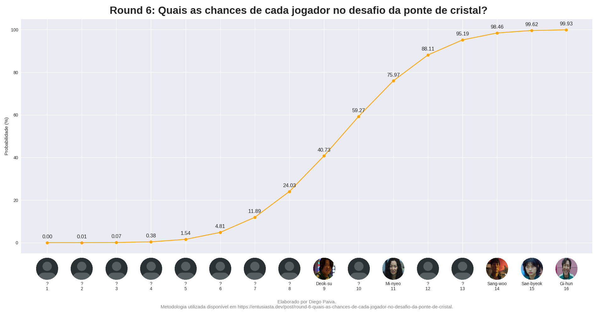

# Round 6: Quais as chances de cada jogador no desafio da ponte de cristal?

Utilizando matemática, estatística e programação é possível criar um modelo capaz de predizer as chances de sobrevivência de cada jogador no desafio da ponte de cristal, da série sul-coreana Round 6.

Mais detalhes em https://entusiasta.dev/post/round-6-quais-as-chances-de-cada-jogador-no-desafio-da-ponte-de-cristal.